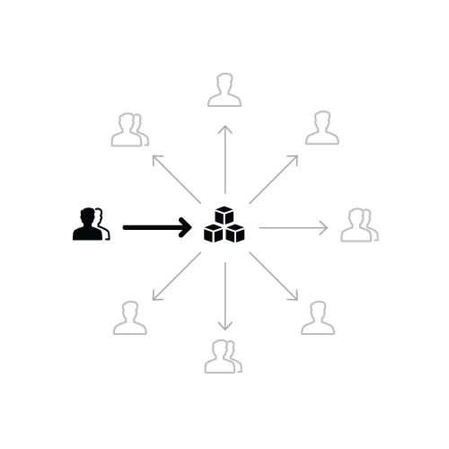
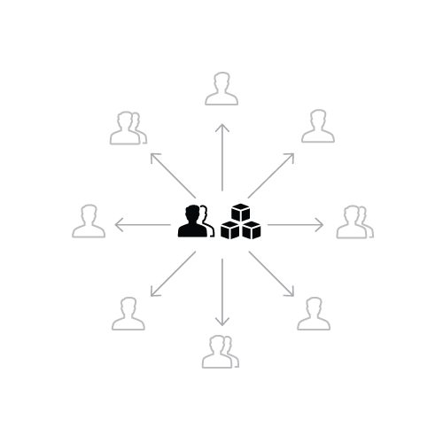
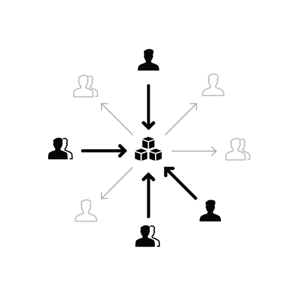
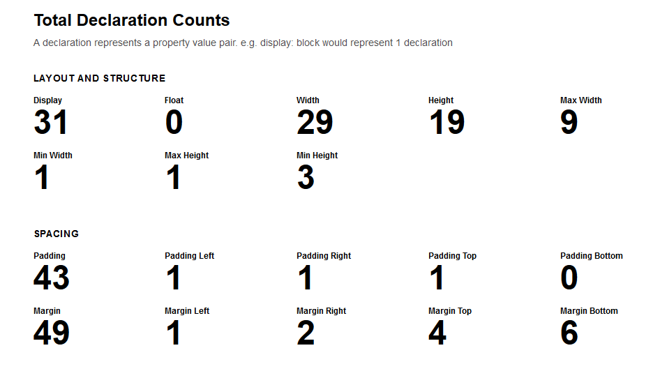

# Design Systems Handbook

Disclaimer: This book was not written by me, this repo is my personal summary of it, and nothing more. For the full book check [DesignBetter.Co](https://designbetter.co) by [Invision](https://www.invisionapp.com/).

# Introducing Design Systems

> Design systems unite product teams around a common visual language, reducing debt, accelerating the design process, and building bridges between teams.

## The power of scale

Douglas Mcllroy presented component-based development, a solution to the "software crisis" that existed in 1960s due to the gap between slow software development and fast hardware. The same challenge exists now, but instead of development, it exists in design.

Problems of consistency arise as a solution scales, in which case companies could do 1 of 3 things:

-   Hire more people
-   Design faster
-   Create solutions that work for multiple problems

> Even with more hands working faster, the reality is bespoke design simply doesn't scale. Design is scaling.

Invesment in design can exist in the following forms:

-   The design team is growing
-   Design is embedded in teams throughout the company
-   Design is playing a key role in all products

> It wasn't hard to get them to follow the guidelines, it was hard to get them to agree on the guidelines. — Lori Kaplan, Atlassian

Design systems address design scaling challenges by marrying two concepts:

-   Standards
-   Components

Standards makes us understand both the _what_ and _why_, which in turn help us create exceptional user experience. They encompass both design and development, including naming conventions, accessibility requirements, and file structure. They also make it easier to critise decisions since there'll be a common design language to base critique on.

Definig the purpose and style of color, shape, type, icons, space, and motion is essential to creating a brand aligned with consistent user experience. Every `component` incorporates these elements.

Components are portions of reusable code and serve as the building blocks of your application's interface. While varying in complexity, reducing them to single functions/uses such as a button or a drop down increases flexibility and reusability.

> The more reusable your components, the less you need to maintain, and the easier scale becomes.

Chapter 3 talks about this.

## The value of design systems

Designs systems can be a painkiller for growing pains in ways:

### Scale design

Having a common design language to unite the product protects user experience and design process from breaking down. Static artifacts can be useful but run out-of-date quickly. An internal design system site is the best, most accessible source of truth.

### Manage your debt

Applications and teams build technical and design debt as they age. Design dept is made up of an overabundance of non-reusable and inconsistent styles and conventions.

_Creation_ doesn't inherently create debt but using a design system will keep you on budget.

### Design Consistently

Standardized components create a more predictable product. They also allow designers to spend less time focused on style and more time developing a better user experience.

### Prototype faster

Using a design system allows to piece together flows and interactions as quickly as pulling LEGO blocks from a bin.

### Iterate more quickly

Using a design system reduces development efforts and makes iteration quick and painless.

### Improve usability

When CSS for countless unique interface elements and their interactions increase, so does cognitive load and page weight. It can also create conflicting code which ultimately ruins UX and DX.

### Build in accessibility

Accessibility can be implemented at the component level by optimizing for those with disabilities, on slow Internet speeds, or on old computers.

## Myths of design systems

Designers can feel limited or restrained, but often these perceived weaknesses are the greatest strengths of a design system.

### Myth 1: too limiting

Myth: Having to stick to a _universal_ system hinders the ability to create custom solutions.

Reality: With design systems, new solutions can be created and fed back into the system.

### Myth 2: loss of creativity

Myth: Designers can't be creative when restricted to a design system.

Reality: Design system components are interdependent. A change in one location will be inhereted throughout the system, leading to less effort when exploring style.

### Myth 3: one and done

Myth: Once the system is designed and built, it's complete and becomes obsolete.

Reality: A design system evolves and is constantly changing, either by effects of maintenance or style iterations.

## Further reading

-   [Software Crisis](https://dbtr.co/software-crisis)
-   [Component-based Software Engineering](https://dbtr.co/component-engineering)
-   [The Way We Build](https://dbtr.co/airbnb-build)
-   [Designed for Growth](https://dbtr.co/etsy-growth)
-   [Selling a Design System before asking for buy-in](https://dbtr.co/selling-system)
-   [The Design of Everyday Things](https://dbtr.co/design-everyday)
-   [What is a Design Language... really?](https://dbtr.co/what-is-design-language)
-   [Things you could be doing instead of designing and building that card component for the umpteenth time](https://dbtr.co/things-you-could)
-   [Website Style Guide Resources](https://dbtr.co/styleguides)
-   [Making Material Design](https://dbtr.co/making-material)
-   [Material Design](https://dbtr.co/material-guidelines)
-   [Shopify Polaris](https://dbtr.co/shopify-polaris)
-   [Starting a Design System](https://dbtr.co/starting-system)

## Designing your design system

Big problems are always more manageable when broken into smaller pieces. Before diving into the design process, start by considering _who_ needs to be involved in the creation of your design system and how the team will work together. This will pave the path for your design language.

### Who should be involved

Design languages require more than just designers. It's a structure that requires input based on research and different POV's. This can be accomplished by merging multiple fields together. Such fields may include:

-   Designers to define the visual elements of the system
-   Frontend developers to create modular, efficient code
-   Accessibility experts to ensure your system conforms to standards like WCAG
-   Content strategists who can help the team nail the voice and tone of the system
-   Researchers who can help you understand customer needs
-   Performance experts who can ensure your system loads quickly on all devices
-   Product managers to ensure the system is aligning to customer needs
-   Leaders (VPs and directors) to champion and align the vision throughout the company including up to executive leadership

> We have this program called the guild... essentially we take one person from each pillar...and for our design system we use them as our user research group. — Rachel Cohen, LinkedIn

### Choosing the right team model

Team models are as important as the teams working on your product. Those include:

#### Model #1: The solitary model

An “overlord” rules the design system.

Pros: Fast and scrappy.

Cons: With one person in charge this can cause a bottleneck.

#### Model #2: The centralized team model

A single team maintains the design system as their full time job.

Pros:

-   Keep the system well maintained
-   Spread a design language to a broad portfolio
-   Serve many product teams, free from the bias of any product’s priorities
-   Identify opportunities and solicit requests to deepen a library
-   Setup practices and processes to validate emerging design

Cons:

-   They may not be as connected to the customers’ needs as they may be less involved in user research
-   Lack context
-   Lack power to foster active participation of designers on product teams
-   Lack visibility into day-to-day, product-specific challenges
-   Lack influence on product designers to balance tradeoffs between product and system objectives

#### Model #3: The federated model

Team members from across the company come together to work on the system.

Pros:

-   Has great insight into what is needed for all the product features and user needs
-   Broadens legitimate relevance to many platforms
-   Limits perceptions of bias by representing many perspectives
-   Eases spreading the system across teams by equipping more evangelists

Cons:

-   Can be quite busy working on those areas already.
-   Introduces practical challenges in decision making by introducing more opinions and new critique.

Many teams are moving away from the solitary model because _overlods_ don't scale. Some are even moving towards a more hybrid approach, joining different models together.

Learn more [here](https://medium.com/eightshapes-llc/team-models-for-scaling-a-design-system-2cf9d03be6a0) or by reading this chapter in the book.

### Interviewing customers

Your design system will get used much more often if you create it to fit into the workflow of other teams. By interviewing users, you can pinpoint problems, define principles that will help others use the system, and focus your energies the most important things. Open source communities and executives, leaders, and management aren't an exception to this either.

Now it's time to build an inventory, of which there are two types:

-   An inventory of visual attributes to create a codified visual language.
-   An inventory of each UI element which will be used to create a UI library of components.

### Creating a visual inventory

This step requires an already existing product. To create a visual inventory we need to conduct a visual audit. This audit will take all the elements we use, and will allow us to look into the CSS behind all of them using tools like [CSS Stats](https://dbtr.co/CSSstats). It will show you how many unique colors, font sizes, and font families you have. It also shows a bar chart for the number of spacing and sizing values.

There are also plugins for your favourite design tool such as [Sketch-Style-Inventory](https://dbtr.co/sketch-style).

#### Creating a visual design language

Each component has fundamental elements that make up its visual design language, these mainly include:

-   Colours
-   Typography (size, leading, typefaces, etc)
-   Spacing (margins, paddings, positioning coordinates, borders)
-   Images (icons, illustrations)

and may include:

-   Visual form (depth, elevation, shadows, rounded corners, texture)
-   Motion
-   Sound

> A button typically has a background color, typography for the label, and spacing inside it. There may be an icon next to the label to create a visual cue. A border on the edge serves as simple ornamentation and may even round the corners. Finally, hovering over or clicking the button could trigger animation or sound as feedback to the user. Though a button may seem simple, there are many design decisions required to bring it to life.

#### Design Tokens

Design tokens are the _subatomic_ foundation of a design systme implementation. They're name and value pairs, all stored in one place. Example: `SPACING_MEDIUM: 1rem`

#### Colour

Colours convey:

-   Feedback: Error and success states
-   Information: Charts, graphs and wayfinding elements
-   Hierarchy: Showing structured order through color and typography

Common colors in a design system include 1-3 primaries that represent your brand. You may add another for buttons and links. A good idea is to use the same background colour for links and buttons as it makes it easier for users to recognize interactive elements. You’ll likely have neutrals for general UI backgrounds and borders—usually greys. And don't forget about states such as error, warning, and success.

Colours may also be set for objects and products.

#### Typography

##### Fonts and weights

The fonts you choose have a high impact on both your brand and your user experience. Keep legibility in mind as you select the right fonts for your system. Use common fonts like Helvetica, Times New Roman, and Verdana.

> Most design systems I’ve worked on include just two typefaces: one font for both headings and body copy, and a monospace font for code. Sometimes there’s an additional font for headings that compliments the body font.

Use light or thin weights at larger text sizes since legibility can become an issue.

##### Type Scale

Consider the legibility of the font you’ve chosen. A 16px font size works well (and is gaining traction as the standard approach). Use a modular scale for font sizes for other elements.

Be sure to give thought to how it will respond to various screen sizes to maintain legibility. A common method is to enlarge headings on larger viewports.

##### Leading

Also known as line-height in CSS, can improve readability aesthetics of your typography. A general rule of thumb is to have leading at around 1.4–1.5x the font-size. 1.5 is recommended by the W3C Web Accessibility Initiative.

You can define your line-height without a unit of measurement and the browser will do all the hard math for you.

> For headings, tighten it up depending on your typeface. In most cases, I find a 1.25 or 1.125 ratio works quite well.

##### Spacing and sizing

Use spacing and sizing systems based on patterns and proportions, and be consistent. Use 4-based metrics as it works well.

Checkout the Google Android design guidelines [here](https://material.io/design/layout/spacing-methods.html#spacing)

> For horizontal spacing, an 8-based scale works quite well. You can make margins and padding equal or in proportion to the font size. But for vertical spacing, I tend to use a 12-based system. This is due to the line-height I get of 1.5 (with the default font size of 16px) getting us to 24.

Sometimes borders will mess up this system, and this is where you customise your use-case. For general sizing, avoid setting widths and heights unless totally necessary.

#### Images

##### File Formats

Use SVG for illustrations and icons, and raster types (PNG, JPG) for photography. You can set 100% width and let height auto for responsiveness, and you may define some presets such as half-width, a third, or a fourth. Set these as max-widths so that the image can rescale for smaller screens.

##### Iconography

Come up with your guidelines before drawing:

-   Filled or outlined
-   Line weight
-   Uses more than 1 color?
-   Sizes
-   Is there an icon art boundary set inside an outer boundary?

##### Illustrations

You can use these for empty states, loading screens, modals, and other components that invite visual interest. [Check out how Shopify did it](https://ux.shopify.com/empty-states-more-like-you-have-no-idea-how-much-work-goes-into-those-states-amirite-e0102f58b64e).

#### Visual form

Is the material quality of your UI and includes:

-   background images and gradients
-   textures
-   shadows and elevation (z-indexes)
-   rounded corners
-   borders

#### Motion and sound

Motion and sound can have a high impact on the experience of your app.

### Creating a user interface library

A user interface library (otherwise known as a pattern library) looks at actual components of a UI. Take stock of all interface elements in production to see just how much design debt you need to address and what elements are most commonly used.

> Warning! This can get a bit depressing, as most companies have an intense amount of inconsistency in their UIs.

To create an interface inventory open all products in production, screenshot all elements and collect them in a slide deck or on big posters where the whole team can see.

Have folks you’re involving conduct this inventory with you. The idea is to gather the different components you’re using and categorize and merge them.

In general, design systems break things down into:

-   Elements (atoms, basics): Small, stand-alone components like buttons and icons
-   Components (molecules, modules): An assembly of small components into a larger component like a search form which includes a form input, a button, and a search icon
-   Regions (zones, organisms): These are areas like a left-hand navigation
-   Layouts: How the pieces are laid out on the page (like a header region, followed by a sidebar and main content area, followed by a footer)

Then you can merge and remove what you don’t need (either in a spreadsheet or even directly in a code refactor if you want more immediate change). Document the component and when to use it. This will become your UI library.

## Further reading

-   [Priyanka Godbole’s Design System article series](https://dbtr.co/priyanka-prototypr)
-   [Nathan Curtis’s Design System article series](https://dbtr.co/nathan-curtis-medium)
-   [Marcin Treder’s Design System article series](https://dbtr.co/mark-treder-design-system)
-   [Brad Frost on creating interface inventories](https://dbtr.co/interface-inventory)
-   [Building a large-scale design system: How we created a design system for the U.S. government by 18F](https://dbtr.co/us-gov-design-system)
-   [Design Systems are for People by Jina Anne](https://dbtr.co/design-systems-people)

# Building your design system

The number of choices available can be overwhelming when choosing a frontend tooling to help you write more maintainable code.

> Your technical approach doesn’t matter as much as creating a living, breathing system that’s flexible, maintainable, stable, scalable, and successful in the long-term.

## Foundations

Regardless of technology, a design system follows these principles:

-   Consistency: The way components are built and managed follows a predictable pattern.
-   Self-contained: Your design system is treated as a standalone dependency.
-   Reusable: You’ve built components used in multiple contexts
-   Accessible: Usable by as many people as possible, no matter how they access the web.
-   Robust: No matter the product or platform to which your design system is applied, it should perform with grace and minimal bugs.

## Consistency

When you have clearly documented code standards and best practices in place, designers and developers can easily use and, contribute to your design system.

### Code style guides

Code style guides provide the grammar rules of syntax and semantics for your code. Code semantics provide the rules for making your code understandable.

[Do fight pointless pointless wars over tabs versus spaces](https://www.youtube.com/watch?v=SsoOG6ZeyUI)

### Automating code style

Help your contributors write code that follows the rules through linting and tooling.

Linting is an automated process of analyzing code and raising errors when code either doesn’t adhere to your syntax rules or is broken, buggy, or malformed.

### Code editor configuration

EditorConfig.org provides a cross-platform format to define stylistic rules for most code editors and IDEs, so you can automatically convert your tabs into spaces—thus ending the tabs versus spaces war!

## Self-contained

Your design system should live in a source control repository independent from your main codebase.

Benefits:

-   Enables versioned releases of your code
-   Allows you to share code across multiple codebases
-   Forces you to develop components in isolation
-   Provides infrastructure for a robust front-end testing architecture
-   Forms a foundation for a living style guide website
-   Functions as a single source of truth.

Ideally, all of the code for each component within your system is co-located. The closer the pieces are to each other, the easier it is to maintain.

## Reusable

Successful design systems are highly reusable. Writing components to be reused in multiple contexts is vitally important.

To be reusable and scalable, patterns need to be modular, composable, generic, and flexible:

-   Modular components are self-contained with no dependencies
-   Composable components can be combined to create new patterns
-   Generic components can handle multiple use cases
-   Flexible components can be tweaked and extended to work in a variety of contexts

### Modular CSS architecture

Reusability and scalability in design systems begin with taking a modular approach to your code architecture. Whichever methodology system you use should have these fundamentals:

-   It has clear naming conventions for components, variations, and utilities
-   It’s tightly-scoped and has low-specificity CSS that limits unintentional side effects
-   It has utility classes that allow you to modify styles in a managed way
-   It has rules for building modular, composable, generic, and flexible components

Learn more about CSS architectures [here](https://dbtr.co/CSSguidelines)

## Accessible

Accessibility, is not just for a small group, but for an estimated 15% of people worldwide with a wide spectrum of permanent or temporary visual, auditory, motor, and cognitive impairments.

> “[Accessibility testing] gives developers a starting point to say ‘here are some errors that I have  tangible ways to go fix now.” — Alicia sedlock — Frontend Engineer & Accessibility Advocate

Improving your site’s accessibility can help improve SEO and help avoid costly lawsuits.

### Enforce a11y with your design system

-   Test your color usage against established color contrast [guidelines](https://dbtr.co/contrast-grid).
-   Build components to be keyboard and screen reader accessible by default. The [Ebay Accessibility MIND pattern library](https://dbtr.co/MINDpatterns) is an amazing, thorough resource to help guide development of accessible components and best practices.
-   Encourage contributors to build according to these guidelines and test their code using keyboard-only navigation and assistive technology devices like screen readers.
-   Include in your documentation code standards and guidelines for common a11y best practices such as using larger, legible text sizes, always associating a form field with a label, and properly adding alt text attributes to images, to name a few. Salesforce’s Lightning design system and Shopify’s Polaris are great examples of accessibility guidelines in practice

## Robust

Testing provides confidence in your code, which facilitates adoption. Users will know that they can upgrade or change their UI without it breaking in unexpected ways. Your design system forms a foundation for testing your front-end code.

### Test your design system instead of your complicated UI

Narrow the scope of your tests and gain more confidence in your front-end code by testing your design system components. Use the different states of each component for your documentation as test fixtures.

### Types of tests

-   Unit testing: Verify that small units of code (usually individual JavaScript functions) behave as expected. Some popular frameworks to use are Mocha, Jasmine, and Jest.
-   Functional testing: In functional tests, examples of your code, or “fixtures” are run in a virtual “headless” browser, then tested by performing simulated user actions, and checking the new state of the browser for the expected result of those actions. Functional testing frameworks include Nightwatch, Protractor, and Casper.
-   Visual regression testing: These tests help catch unintended visual changes to component styles. The test framework takes screenshots of your fixtures both before and after the changes, then compares them using an algorithm to detect visual differences. There are open source frameworks like Wraith, Gemini, and BackstopJS, as well as paid services like Applitools and Percy.io. Go to Kevin Lamping’s excellent resource [Visual Regression Testing](https://dbtr.co/visual-regression) for more information and options.
-   Automated accessibility testing: Leverage tooling to ensure that your components are accessible. Some options for running automated a11y audits are Paypal’s [AATT](https://dbtr.co/AATT) and [a11y](https://dbtr.co/a11y_addyosmani) by Addy Osmani, and [aXe](https://dbtr.co/aXe) by Deque Systems

## Common challenges

-   Keeping documentation up-to-date with your system code
-   Handling breaking changes
-   Avoiding performance degradations

## Maintaining Documentation

Maintaining a documentation website that's separate from the main codebase breaks the DRY principle. Code will be duplicated and changes will need to happen in both codebases is tedious and will quickly run out-of-date.

### Minimize separation between library code and documentation code

When documentation and code are co-located, it’s more likely that you’ll remember to update the documentation when a component changes. Pre-commit hooks to your design system repository to warn contributors when their code adjustments don’t also contain updated documentation files.

Github is already configured to render and display any file named README.md when you’re viewing a folder’s contents, so Markdown files may be enough. Use automation to simplify the process. There are [tools](https://github.com/davidhund/styleguide-generators) to help you instead of building a website from the ground up.

## Handling change

The Morningstar design system provides guidance to contributors on what is considered a breaking change. If mishandled, breaking changes can be a major pain.

### The wrong way: duplication

It became such a headache to make major structural changes to existing components that our team at Etsy started to duplicate and deprecate—when we refactored our Tab component to make it fully accessible, we created a new component named “Tabs2,” and deprecated “Tabs” in the hopes that teams would take on the work to upgrade their code. But without clear guidance on how, why, and a timeline stating when to upgrade, most uses haven’t been updated to use the new component. This kind of duplication is a code maintenance nightmare.

### The right way: versioning

Breaking changes are easier to manage if you store your code in its own source control repository. Git allows you to tag a commit with a release version number, and package managers allow you to package up multiple versions of your design system code.

With versioned releases, adopters that integrate your code can target a specific version as a dependency. Release notes detailing changes can help others plan for the upgrade.

## Avoiding performance degradations

The size of assets grows over time which can negatively impact performance. According to statistics from Googleand Akamai, more than half of mobile visitors will abandon pages that take longer than 3 seconds to load, yet the majority of mobile sites take longer than 10 seconds to load.

Build your system mobile-first, and test early and often in real conditions.

### Leverage modularity

To leverage modularity you can:

-   Package the most frequently used set of `core` components and utilities to be cached across pages.
-   Ensure that all components are fully modular with no cross-component dependencies (unless they are explicit and managed by the system).

## Forward-thinking

### Design Tokens

Today, we build for multiple web and native platforms that need design consistency. Larger organizations may have multiple sub-brands that want the shared support, functionality, and organization that a design system brings, but each needs a different, brand-aligned look and feel

### Cross-platform sharing

Using Theo you can create a shared JSON of tokens and compile them to platform-specific code.

### Multi-product theming

You can also use tokens to “theme” the same structural styling for multiple brands by defining different token values for each brand, then combine each to the same, base CSS to output themed versions of your design system.

## Further Reading

-   [Website Style guide Resources](https://dbtr.co/salesforce-theo)
-   [Styleguide Driven Development](https://dbtr.co/salesforce-theo)
-   [Styleguide Best Practices](https://dbtr.co/salesforce-theo)
-   [CSS Architecture for Design Systems](https://dbtr.co/salesforce-theo)
-   [Front-end Architecture for Design Systems (book)](https://dbtr.co/salesforce-theo)
-   [Accessibility for Everyone (book)](https://dbtr.co/salesforce-theo)
-   [Web Accessibility Resources](https://dbtr.co/salesforce-theo)
-   [Front-end Performance Checklist](https://dbtr.co/salesforce-theo)
-   [Designing for Performance](https://dbtr.co/designing-performance)
-   [Rebuilding Slack.com](https://dbtr.co/rebuilding-slack)
-   [Tokens in Design Systems](https://dbtr.co/tokens)
